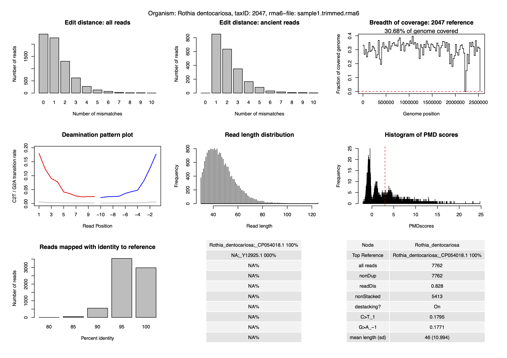

## Introduction

In this part, we will start authenticating the pathogens found by the `krakenuniq` tool. This part is complex and needs database dependencies to work. So we will focus only one microbe (*taxid* 2047) from the sample `sample1`.

We will run an `sbatch` script, and we will check the outputs. Before working on this part, lets export the `PATH` variable to check the output files:

```bash
export PATH=${PATH}:/truba/home/egitim/miniconda3/envs/aMeta/bin/
```

The main logic in this section, is to:

+ Get information of the scientific name and sequence id information of the particular microbe
+ Extract DNA reads assigned to one specific microbe
+ Calculate several authentication parameters from the `sample1.trimmed.rma6` file
+ Create a `bam` file from the `sample1.trimmed.sam.gz` using the sequence id of the microbe
+ Extract read length, breadth of coverage, and post-mortem decay parameters from the `sam` file
+ Combine these information into nice looking pdf file
+ Calculate the authenticatio score for the particular microbe

First, let's run the `sbatch` script, and then we will start checking the main output files while it is running:

```bash
sbatch Authentic.sh --account=egitim  
```

## Scientific name and sequence ID extraction

Let's go step by step.

In the `krakenuniq` part, we created a file called `taxID.pathogens`.

Let's check this file:

```bash
less /truba/home/egitim/aMeta/results/KRAKENUNIQ/sample1/taxID.pathogens
```

Afterwards, we will extract the node name from the `krakenuniq` database. We can not show the output, because it needs the big krakenuniq database.

Let's check the output:

```bash

less /truba/home/egitim/aMeta/results/AUTHENTICATION/sample1/2047/node_list.txt

```

THis pathogen name is *Rothia dentocariosa*. Over the next steps, we will extract DNA reads assigned to this pathogen, and we will create authenticity metrics.

Then we will extract the sequence name of the reference sequence of the bacteria from the database:

```bash
/truba/home/egitim/aMeta/results/AUTHENTICATION/sample1/2047/name_list.txt
```

## DNA read extraction and postprocessing

Then we will use `MaltExtract` and `postprocessing.AMPS.r` tools to extract DNA reads assigned to this pathogen, from the rma6 file of the sample1.

Let's check this folder:

```bash

ls /truba/home/egitim/aMeta/results/AUTHENTICATION/sample1/2047/MaltExtract_output/
```

The `ancient` folder contains statistics only for ancient DNA reads, and `default` folder contains statistics for all DNA reads.

If we check the `default` folder, we can see that several parameters are organized into sub folders:

```bash
s /truba/home/egitim/aMeta/results/AUTHENTICATION/sample1/2047/MaltExtract_output/modern/
```

## Creating a `sam` file for the microbe of interest

In this step, we extract alignment entries from the malt `sam` file using this sequence ID that we previously extracted, 

Let's check the output file:

```bash
samtools view /truba/home/egitim/aMeta/results/AUTHENTICATION/sample1/2047/sorted.bam | less
```

From this file, we will extract breadth of coverage and read length distribution information:

```bash
less /truba/home/egitim/aMeta/results/AUTHENTICATION/sample1/2047/breadth_of_coverage
less /truba/home/egitim/aMeta/results/AUTHENTICATION/sample1/2047/read_length.txt
```

Then we extract DNA sequence of the reference file to use with IGV tool:

```bash
less /truba/home/egitim/aMeta/results/AUTHENTICATION/sample1/2047/CP009643.1.fasta
```

We calculate PMD scores:

```bash
less /truba/home/egitim/aMeta/results/AUTHENTICATION/sample1/2047/PMDscores.txt

```

## Combine authentication parameters and score

Using the `authentic.R` script, we create the last authentication plot:

```bash
ls /truba/home/egitim/aMeta/results/AUTHENTICATION/sample1/2047/authentic_Sample_sample1.trimmed rma6_TaxID_2047.pdf
```

Lets check the authentication plot:



And at last, authentication scores:

```bash

less /truba/home/egitim/aMeta/results/AUTHENTICATION/sample1/2047/authentication_scores.txt
```
The script should have finished by now. Let's check the output folder:


```bash
ls results/AUTHENTICATION/sample1/2047
```