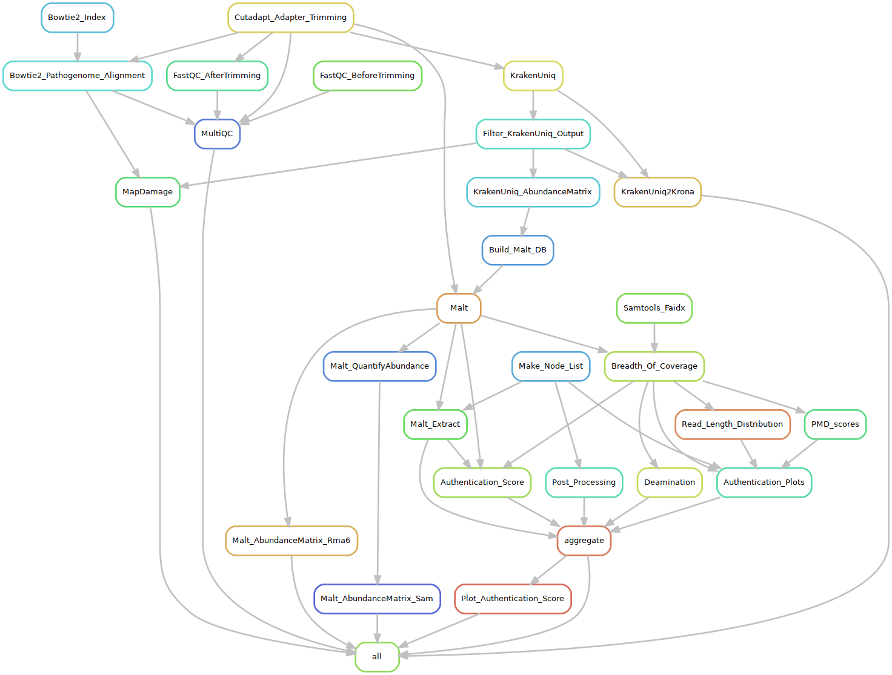

## aMeta workflow graph

Here is an overview of all the rules of the aMeta snakemake pipeline. Such an overview of a workflow in form of a graph is called a dag or rulegraph. You can consider these rules as steps of the workflow going from up to down.

